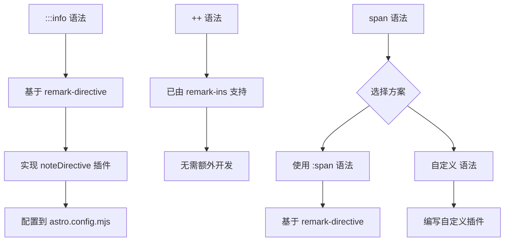

# 自定义 Markdown 语法实现调研报告

## 概述

本报告调研如何基于 remark/rehype 生态系统实现以下三种自定义 Markdown 语法：

1. `:::info` 容器语法 → Note MDX 组件
2. `++` 语法 → ins 组件（下划线/插入）
3. `[xxx]` 语法 → `<span>xxx</span>`

## 项目现状分析

### 当前 remark 插件配置

项目在 [`astro.config.mjs`](astro.config.mjs:131) 中已配置以下 remark 插件：

```javascript
remarkPlugins: [
  remarkMath,
  remarkBreaks,
  remarkRubyDirective,
  remarkIns, // 已支持 ++ 语法
  remarkDirective, // 已支持 ::: 语法
  remarkGfm,
  remarkEmoji,
  remarkExtendedTable,
  [spoiler, { title: "..." }], // 自定义 !! 语法
];
```

### 现有自定义插件示例

项目已有 [`spoiler.mjs`](src/remark-plugins/spoiler.mjs:1) 作为自定义 remark 插件的参考实现，它实现了 `!!text!!` 语法转换为 `<Spoiler>` 组件。

---

## 一、`:::info` 容器语法实现 Note 组件

### 1.1 remark-directive 插件分析

项目已安装 [`remark-directive`](https://github.com/remarkjs/remark-directive)，支持以下三种语法：

| 语法                 | 类型     | AST 节点             |
| -------------------- | -------- | -------------------- |
| `:::name\n内容\n:::` | 容器指令 | `containerDirective` |
| `::name`             | 叶子指令 | `leafDirective`      |
| `:name`              | 行内指令 | `textDirective`      |

### 1.2 实现方案

需要添加一个 remark 插件来处理 `containerDirective` 节点，将其转换为 MDX JSX 元素。

#### 语法示例

```markdown
:::info
这是一个信息提示框
:::

:::warning title="注意事项"
这是一个带标题的警告框
:::

:::success
**成功提示**
内容支持 Markdown 格式
:::
```

#### 插件实现代码

```javascript
// src/remark-plugins/note-directive.mjs
import { visit } from "unist-util-visit";

/**
 * remark-directive 的处理器
 * 将 :::info, :::warning 等容器转换为 Note 组件
 */
export default function noteDirective() {
  return (tree) => {
    visit(tree, (node) => {
      if (node.type === "containerDirective" || node.type === "leafDirective") {
        const type = node.name;
        const validTypes = ["info", "warning", "success", "danger", "primary", "default"];

        if (!validTypes.includes(type)) return;

        const data = node.data || (node.data = {});
        const attributes = node.attributes || {};

        // 转换为 MDX JSX 元素
        data.hName = "Note";
        data.hProperties = {
          type: type,
          ...(attributes.title && { title: attributes.title }),
          ...(attributes.icon && { icon: attributes.icon }),
        };
      }
    });
  };
}
```

#### 配置方式

```javascript
// astro.config.mjs
import noteDirective from "./src/remark-plugins/note-directive.mjs";

remarkPlugins: [
  remarkDirective, // 必须在 noteDirective 之前
  noteDirective,
  // ...其他插件
];
```

### 1.3 替代方案：remark-container

也可以使用 [`remark-container`](https://github.com/ArvinX/remark-container) 插件，它专门用于处理容器语法：

```javascript
import remarkContainer from "remark-container";

remarkPlugins: [
  [
    remarkContainer,
    {
      containers: ["info", "warning", "success", "danger"],
    },
  ],
];
```

---

## 二、`++` 语法实现 ins 组件

### 2.1 现状分析

项目已安装 [`remark-ins`](https://github.com/parkingzmn/remark-ins)，它将 `++text++` 转换为 `<ins>text</ins>` HTML 元素。

### 2.2 验证测试

在 Markdown 中使用：

```markdown
这是 ++插入的内容++ 显示为下划线。

++重要更新++ 已发布。
```

渲染结果：

```html
<p>这是 <ins>插入的内容</ins> 显示为下划线。</p>
<p><ins>重要更新</ins> 已发布。</p>
```

### 2.3 自定义组件映射

如果需要将 `<ins>` 映射到自定义的 `<Underline>` 组件（已在项目中定义），有两种方案：

#### 方案 A：通过 rehype 插件替换

```javascript
// src/rehype-plugins/ins-to-underline.mjs
import { visit } from "unist-util-visit";

export default function insToUnderline() {
  return (tree) => {
    visit(tree, "element", (node) => {
      if (node.tagName === "ins") {
        // 添加类名以应用自定义样式
        node.properties = node.properties || {};
        node.properties.className = ["underline", "primary"];
      }
    });
  };
}
```

#### 方案 B：修改 remark-ins 输出为 MDX 组件

```javascript
// src/remark-plugins/ins-mdx.mjs
import { visit } from "unist-util-visit";

export default function insMdx() {
  return (tree) => {
    visit(tree, "text", (node, index, parent) => {
      if (!parent || typeof index !== "number") return;

      const value = node.value;
      if (typeof value !== "string" || value.indexOf("++") === -1) return;

      // 类似 spoiler.mjs 的实现，解析 ++ 并转换为 mdxJsxTextElement
      // ...详细实现略
    });
  };
}
```

### 2.4 结论

`remark-ins` 已能满足基本需求，项目中 [`Underline.astro`](src/components/mdx/Underline.astro:11) 组件使用 `<ins>` 标签，样式已定义完善，**无需额外开发**。

---

## 三、`[xxx]` 语法实现 span 组件

### 3.1 问题分析

`[xxx]` 语法与 Markdown 原生链接语法冲突：

- `[text](url)` 是标准链接
- `[xxx]` 单独出现时可能是参考链接

需要定义更明确的语法边界，建议方案：

| 语法                     | 含义                                   |
| ------------------------ | -------------------------------------- |
| `[xxx]`                  | 纯 span（需要自定义解析）              |
| `[xxx]{.class}`          | 带属性的 span（remark-directive 语法） |
| `[#xxx]` 或 `[span xxx]` | 特殊标记的 span                        |

### 3.2 推荐方案：使用 remark-directive 的行内语法

利用已有的 `remark-directive`，使用 `:span` 语法：

```markdown
:span[内容文本]
:span[带颜色的文字]{.text-red}
```

#### 插件实现

```javascript
// src/remark-plugins/span-directive.mjs
import { visit } from "unist-util-visit";

export default function spanDirective() {
  return (tree) => {
    visit(tree, "textDirective", (node) => {
      if (node.name !== "span") return;

      const data = node.data || (node.data = {});
      data.hName = "span";

      // 传递属性
      if (node.attributes) {
        data.hProperties = node.attributes;
      }
    });
  };
}
```

### 3.3 替代方案：自定义 `[xxx]` 语法

如果必须使用 `[xxx]` 语法，需要自定义 remark 插件：

```javascript
// src/remark-plugins/span-syntax.mjs
import { visit } from "unist-util-visit";

/**
 * 将 [xxx] 转换为 <span>xxx</span>
 * 注意：会与链接语法冲突，需要特殊处理
 */
export default function spanSyntax() {
  return (tree) => {
    visit(tree, "text", (node, index, parent) => {
      if (!parent || typeof index !== "number") return;
      if (parent.type === "link") return; // 跳过链接内的文本

      const value = node.value;
      // 匹配 [xxx] 但不匹配 [xxx](
      const regex = /\[([^\]]+)\](?!\()/g;

      if (!regex.test(value)) return;

      const parts = [];
      let lastIndex = 0;
      let match;

      regex.lastIndex = 0; // 重置正则

      while ((match = regex.exec(value)) !== null) {
        // 添加前面的文本
        if (match.index > lastIndex) {
          parts.push({ type: "text", value: value.slice(lastIndex, match.index) });
        }

        // 添加 span 元素
        parts.push({
          type: "mdxJsxTextElement",
          name: "span",
          attributes: [],
          children: [{ type: "text", value: match[1] }],
        });

        lastIndex = regex.lastIndex;
      }

      if (parts.length === 0) return;

      // 添加剩余文本
      if (lastIndex < value.length) {
        parts.push({ type: "text", value: value.slice(lastIndex) });
      }

      parent.children.splice(index, 1, ...parts);
      return index + parts.length;
    });
  };
}
```

### 3.4 风险提示

自定义 `[xxx]` 语法的风险：

1. **与链接语法冲突**：`[text]` 后跟 `(` 时是链接
2. **与参考链接冲突**：`[ref]` 是有效的参考链接语法
3. **解析复杂度**：需要精确判断上下文

建议采用以下安全语法：

- `[#xxx]` - 使用特殊前缀标记
- `[span:xxx]` - 显式标记
- 使用 `:span[xxx]` 的 directive 语法

---

## 实现建议

### 推荐实现顺序



### 需要创建的文件

| 文件路径                                | 用途                  |
| --------------------------------------- | --------------------- |
| `src/remark-plugins/note-directive.mjs` | 处理 :::info 容器语法 |
| `src/remark-plugins/span-syntax.mjs`    | 可选：处理 [xxx] 语法 |

### astro.config.mjs 更新

```javascript
import noteDirective from "./src/remark-plugins/note-directive.mjs";
// import spanSyntax from "./src/remark-plugins/span-syntax.mjs"; // 可选

remarkPlugins: [
  remarkMath,
  remarkBreaks,
  remarkRubyDirective,
  remarkIns,
  remarkDirective,
  noteDirective, // 添加在 remarkDirective 之后
  // spanSyntax,  // 可选
  remarkGfm,
  remarkEmoji,
  remarkExtendedTable,
  [spoiler, { title: "..." }],
];
```

---

## 总结

| 语法      | 实现难度 | 推荐方案                           | 是否需要新增插件 |
| --------- | -------- | ---------------------------------- | ---------------- |
| `:::info` | 低       | remark-directive + 自定义处理器    | 是               |
| `++`      | 已实现   | remark-ins                         | 否               |
| `[xxx]`   | 中/高    | 使用 `:span[xxx]` 替代或自定义插件 | 视方案而定       |

`:::info` 语法只需添加一个简单的 AST 转换插件；`++` 语法已可用；`[xxx]` 语法建议改用 `:span[xxx]` 以避免语法冲突。
